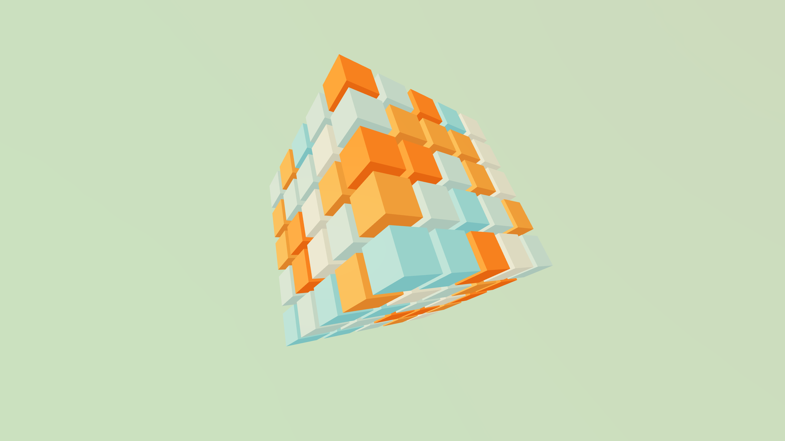
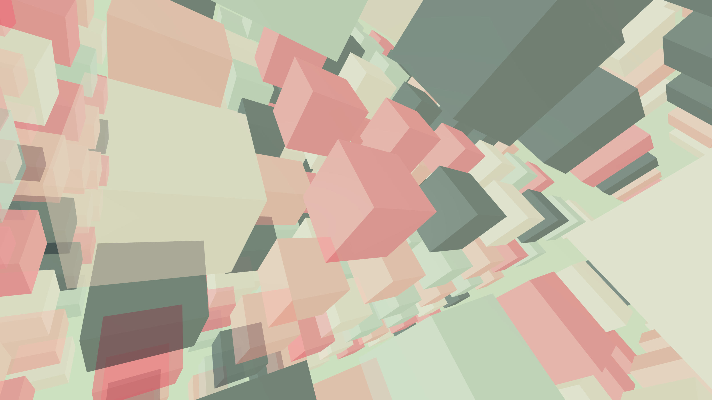

# 🎨 React Three Fiber Box Art Generator

Generate colorful 3D box mesh PNG images using React Three Fiber.\

This project is a small React application that generates colorful 3D box mesh PNG images, utilizing the React Three Fiber library for rendering 3D objects. Users can interactively customize the box mesh instances, adjusting colors and sizes to create visually appealing images.

## 🌟 Features

React Three Fiber for 3D rendering
Interactive UI for box mesh customization
Support for various colors
PNG image exporting

## 📜 License

This project is licensed under the MIT License.

## 🔗 Overall

This project is a great example of how React Three Fiber can be used to create interactive 3D graphics and export images in a React application. Whether you're a developer looking to add some visual flair to your project, or simply interested in exploring the capabilities of React Three Fiber, this project is definitely worth checking out!
